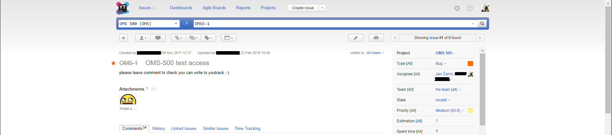
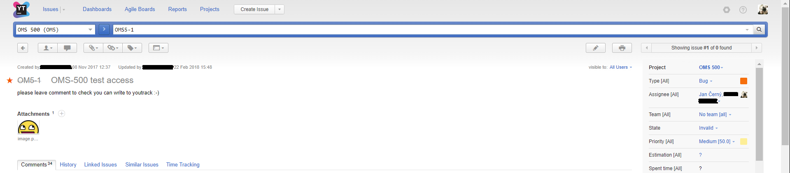

# YouTrack Wider
This add-on injects JavaScript into YouTrack web pages for wider view. 

Compatible with YouTrack *2017.4 Build 39533* and lower.

Before add-on: 

After add-on:

## Release Notes
* minor bug fix
* size reduction

## Add-on for FireFox
[YouTrack Wider v1.4](https://addons.mozilla.org/cs/firefox/addon/youtrack-wider/)

## Add-on for Chrome
* download file [YouTrack Wider v1.4](https://github.com/cernyjan/YouTrack-Wider/blob/master/youtrack_wider-1.4-an+fx.xpi)
* extract it on the file system
* open Extensions page in browser
* click the “Developer mode” checkbox to activate it
* click the “Load unpacked extension” button
* Navigate to the extension’s directory and open it