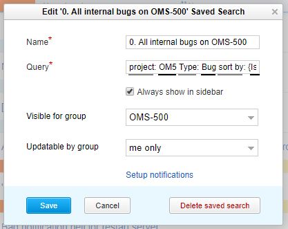
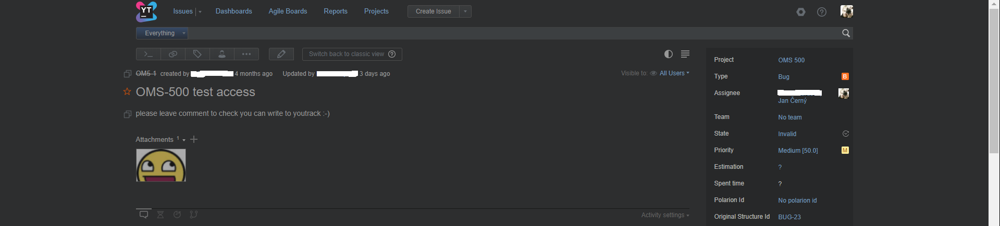
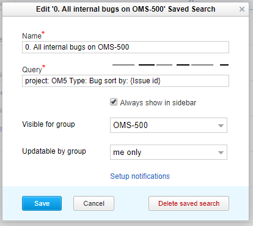
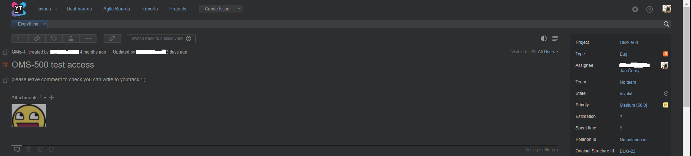

# YouTrack Wider
This add-on injects JavaScript into YouTrack web pages for wider view. 

Compatible with YouTrack *2018.1 Build 39916* and lower.

Before add-on: 

After add-on:

## Release Notes
### v1.6
* fixed bug: Does not work in "Use experimental version of full page issue view by default" 

### v1.5
* about 50% bigger field for edit Saved search
* added support for new (experimental) theme 

### v1.4
* minor bug fix
* size reduction

## Add-on for FireFox
[YouTrack Wider v1.6](https://addons.mozilla.org/cs/firefox/addon/youtrack-wider/)

## Add-on for Chrome
* download file [YouTrack Wider v1.6](https://github.com/cernyjan/YouTrack-Wider/blob/master/youtrack_wider-1.6-an+fx.xpi)
* extract it on the file system
* open Extensions page in browser
* click the “Developer mode” checkbox to activate it
* click the “Load unpacked extension” button
* Navigate to the extension’s directory and open it